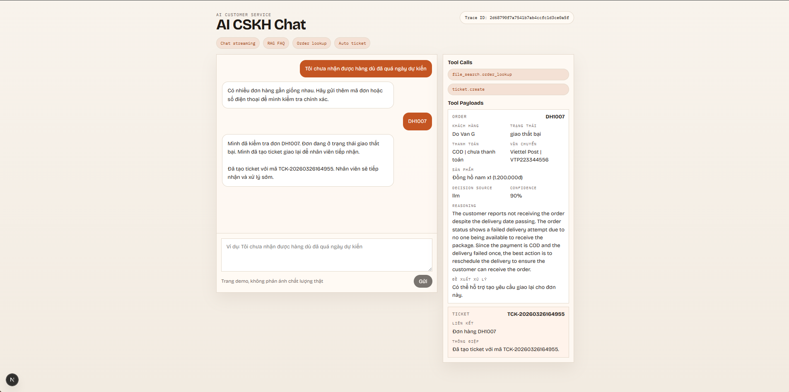
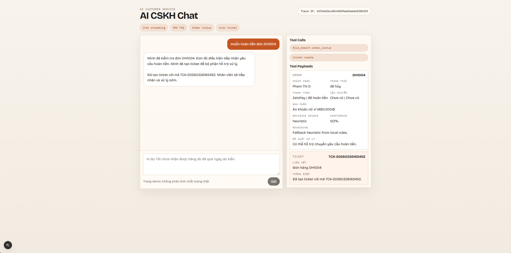

# AI CSKH Demo

Một hệ thống AI hỗ trợ chăm sóc khách hàng (Customer Service Agent) được thiết kế riêng cho các quy trình thương mại điện tử.

Dự án này được tổ chức theo kiến trúc monorepo bao gồm:
- Một Backend sử dụng **FastAPI** và điều phối bằng **LangGraph**.
- Một Frontend **Next.js** với giao diện chat stream.
- Luồng truy xuất thông tin hỗ trợ (FAQ retrieval) bằng **LlamaIndex + FAISS**.
- Các công cụ (tools) xử lý cục bộ cho việc tra cứu đơn hàng và tạo ticket hỗ trợ.

## Tính Năng Chính

- Trả lời các câu hỏi hỗ trợ khách hàng dạng FAQ bằng phương pháp truy xuất ngữ cảnh (RAG).
- Nhận diện tự động các yêu cầu về đơn hàng: kiểm tra trạng thái, yêu cầu giao lại, hủy đơn và yêu cầu hoàn tiền.
- Tra cứu thông tin trên dữ liệu đơn hàng giả lập bằng file JSON cục bộ.
- Tạo ticket hỗ trợ mẫu và hiển thị chi tiết các thao tác của Agent trên giao diện người dùng.
- Trả về câu trả lời dạng luồng (streaming) theo thời gian thực từ Backend lên Frontend.
- Giữ bộ nhớ ngữ cảnh ngắn hạn cho mỗi một phiên chat riêng biệt.

## Công Nghệ Sử Dụng

### Backend
- FastAPI
- LangGraph
- LangChain / Tích hợp mô hình OpenAI
- LlamaIndex + FAISS
- SQLite (lưu trữ lịch sử chat)

### Frontend
- Next.js (App Router)
- React
- Vercel AI SDK (`useChat`)

### Vận hành & Công cụ phụ trợ
- Docker Compose
- Pytest
- TypeScript

## Cấu Trúc Thư Mục

```text
backend/
  app/        Tệp ứng dụng FastAPI, đồ thị LangGraph, services, tools
  data/       Dữ liệu mẫu (FAQ và đơn hàng)
  scripts/    Các script tiện ích (ví dụ: chạy vector index)
  tests/      Unit test cho backend
frontend/
  app/        Next.js app router và các route API proxy
  components/ Giao diện Chat UI và bảng hiển thị chi tiết Tool Payload
docs/
  architecture.md
  setup.md
  development.md
```

## Ảnh chụp màn hình




## Tài Liệu Hướng Dẫn

- **[Hướng dẫn Cài đặt & Chạy dự án (Local & Docker)](docs/setup.md)**
- **[Các hạn chế của bản demo](docs/development.md)**
- **[Chi tiết kiến trúc hệ thống](docs/architecture.md)**
