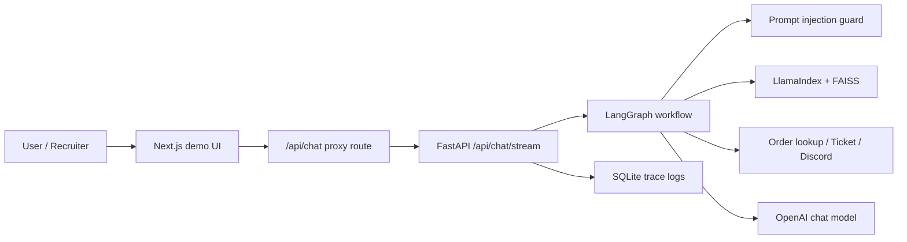

# Architecture

## Data Flow

1. Frontend gửi message qua proxy route để tránh CORS khi deploy.
2. FastAPI chạy LangGraph workflow gồm sanitize, retrieve, tool dispatch, generate.
3. Mọi query/response được log cùng `trace_id` vào SQLite.
4. Kết quả được stream text về frontend, đồng thời gửi metadata tool call qua header.
